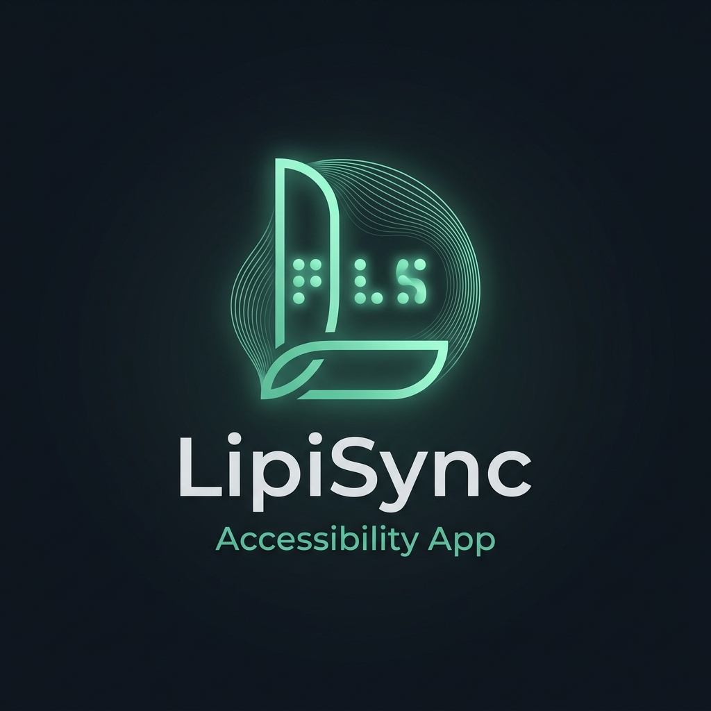

<p align="center">
  
</p>

<h1 align="center">⠠⠇⠊⠏⠊⠠⠎⠽⠝⠉ LipiSync</h1>

<p align="center">
  <b>Intelligent Braille Workspace & Translation Suite (v2.0)</b>
</p>

<p align="center">
  <i>A premium, fully accessible desktop environment built with PyQt6, providing real-time multi-grade Braille translation, computer vision OCR scanners, document processing, voice translation, and interactive courses.</i>
</p>

<p align="center">
  
  
  
  
</p>

<p align="center">
  <a href="#-quick-start">⚡ Quick Start</a> • 
  <a href="#-features">📖 Features</a> • 
  <a href="#-keyboard-shortcuts">⌨️ Keyboard Shortcuts</a> • 
  <a href="#-project-structure">📂 Project Structure</a> •
  <a href="#%EF%B8%8F-distribution--builds">⚙️ Distribution & Builds</a>
</p>

---

### 🎯 Key Features at a Glance

| ⇄ Translator | 📷 OCR Scan | 🔊 Vocalizer | ✓ Accessibility |
| :---: | :---: | :---: | :---: |
| **UEB & Bharati Braille** | **Computer Vision** | **TTS & MP3 Export** | **Shortcut Audits** |
| Bi-directional translation for English, Hindi, Marathi, and other regional languages. | OpenCV contour and cluster detection from handwritten or printed Braille. | High-fidelity vocal studio with custom speed controls and audio exporter. | Screen-reader feedback with built-in accessibility compliance diagnostic tools. |

---

### 📋 Table of Contents

- [💡 Problem Statement](#-problem-statement)
- [✨ Core Capabilities](#-core-capabilities)
- [⚡ Quick Start](#-quick-start)
- [⌨️ Keyboard Shortcuts](#-keyboard-shortcuts)
- [📂 Project Structure](#-project-structure)
- [⚙️ Distribution & Builds](#%EF%B8%8F-distribution--builds)
- [🛡️ Security Disclaimer](#-security-disclaimer)
- [🤝 Contributing & Feedback](#-contributing--feedback)
- [⭐ Show Your Support](#-show-your-support)
- [👤 Author & Contact](#-author--contact)
- [📄 License](#-license)

---

### 💡 Problem Statement

Visually impaired users, students, and educators face significant barriers when working with tactile writing systems:
* **Complex Standards:** Learning Unified English Braille (UEB) contractions or Devanagari (Bharati Braille) takes substantial time.
* **Lack of Tools:** Sighted teachers struggle to convert math notations and complex worksheets to Braille instantly.
* **Isolated Features:** Digital tools are often split between OCR readers, audio recorders, and translation engines.

**LipiSync** resolves this by providing a unified, dark-mode accessible workspace featuring multi-grade conversion, vocal studio feedback, document reading, and interactive self-evaluation courses.

---

### ✨ Core Capabilities

* **Multi-Grade Braille Translation:** Real-time bi-directional conversion with dynamic visual 6-dot character grids.
* **Document Scanner (OCR):** Advanced image processing using custom OpenCV contour analysis to detect handwritten, printed, and embossed Braille cells.
* **Vocalizer Studio:** High-fidelity TTS feedback that lets creators export Braille translations directly to standalone `.mp3` or `.wav` files.
* **Nemeth Math Translator:** Simple editor translating algebraic formulas and numerals into compliant Braille notations.
* **Learning & Quiz Center:** Gamified progress tracker with interactive lessons designed for both sighted learners and visually impaired students.
* **Split-Pane History Logs:** Inspection dashboard to review, filter, and bookmark past conversions instantly.
* **Voice Translation:** Convert microphone speech input directly into Braille text on-the-fly.

---

### ⚡ Quick Start

#### 1. Clone the repository
```bash
git clone https://github.com/shlok926/LipiSync.git
cd LipiSync
```

#### 2. Install dependencies
```bash
pip install -r requirements.txt
```

#### 3. Launch the application
```bash
python main.py
```

---

### ⌨️ Keyboard Shortcuts

LipiSync is fully keyboard accessible, supporting instant screen-reader focus shortcuts:

| Shortcut | Action |
|---|---|
| **Alt + 1** to **Alt + 9** | Switch active workspace pages |
| **Ctrl + Shift + S** | Speak/vocalize selected braille output |
| **Ctrl + 3** | Copy output text to clipboard |
| **Tab / Shift + Tab** | Focus navigation on UI elements |

---

### 📂 Project Structure

```
LipiSync/
├── main.py                   # Application entry point
├── ui.py                     # PyQt6 layout, pages, and dynamic styling
├── braille_engine.py         # Core translation parser and mapping logic
├── braille_maps.py           # Bharati & UEB unicode character maps
├── ocr_module.py             # OpenCV computer vision dot detection algorithms
├── enhanced_ocr.py           # Advanced handwritten and embossed OCR scanning logic
├── document_processor.py     # PDF & TXT document reader and exporter
├── braille_grades.py         # Grade 1 to Grade 2 contracted Braille converter
├── math_notation.py          # Math to Nemeth & UEB Math converter
├── braille_learning.py       # Interactive course modules, tracking, and quiz engines
├── accessibility_audit.py    # Accessibility audit logs and UI checking tools
├── accessibility_features.py # Screen readers, keyboard managers, and blind helpers
├── audio_feedback.py         # TTS vocal engine core
├── audio_export.py           # TTS to MP3/WAV audio export utility
├── clipboard_manager.py      # System clipboard watcher and converter
├── settings_manager.py       # Persistent configuration manager
├── speech_to_braille.py      # Audio speech-to-text to Braille pipeline
├── statistics_tracker.py     # User analytics and statistics tracker
├── installer.iss             # Inno Setup compilation script for Setup Installer
├── build.bat                 # Local compiler batch script
├── requirements.txt          # Project packages list
└── .gitignore                # Git version control rules
```

---

### ⚙️ Distribution & Builds

LipiSync can be packaged into a fast-loading Windows installer so that it runs instantly without needing Python installed on the target machine.

#### Build the Project Directory (Onedir)
To compile the raw files into an optimized executable directory structure, run the following:
```bash
# Uses the pre-configured spec file to compile the executable
pyinstaller braille_converter.spec --clean
```
This outputs the app bundle in `dist/BrailleConverter/`.

#### Generate the Setup Installer (Inno Setup)
1. Download and install [Inno Setup](https://jrsoftware.org/isinfo.php).
2. Open the **`installer.iss`** file in the Inno Setup Compiler.
3. Press **`Ctrl + F9`** (or go to `Build` -> `Compile`).
4. This outputs a lightweight, optimized installation package at **`dist/LipiSync_Setup.exe`** (~100 MB). Running this installer puts the app in Program Files and creates a Desktop shortcut that launches instantly.

---

### 🛡️ Security Disclaimer

LipiSync does not upload or transmit any of your files, local conversion histories, or audio exports. All translations, logs, and persistent settings are stored entirely offline in your system's configuration directories.

---

### 🤝 Contributing & Feedback

Contributions are what make the open source community such an amazing place to learn, inspire, and create. Any contributions you make are **greatly appreciated**. 

Feel free to fork the repository, open a pull request, or report bugs in the Issues section.

---

### ⭐ Show Your Support

If LipiSync has helped you translate, study, or teach Braille, please consider giving this project a ⭐ on GitHub! Your support helps make the project more visible and encourages ongoing development.

---

### 👤 Author & Contact

Developed and Maintained by **Shlok Thorat** ([@shlok926](https://github.com/shlok926))

*   **Email:** shlokthorat9@gmail.com
*   **GitHub Issues:** [Open a Support Ticket](https://github.com/shlok926/LipiSync/issues)

*© 2026 LipiSync Team. Designed with accessibility in mind.*
